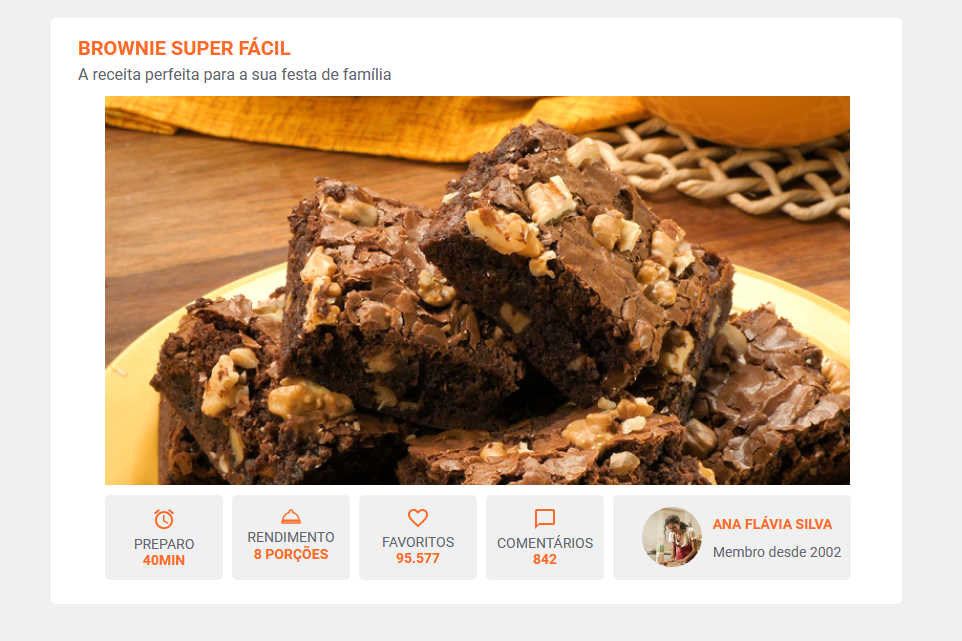
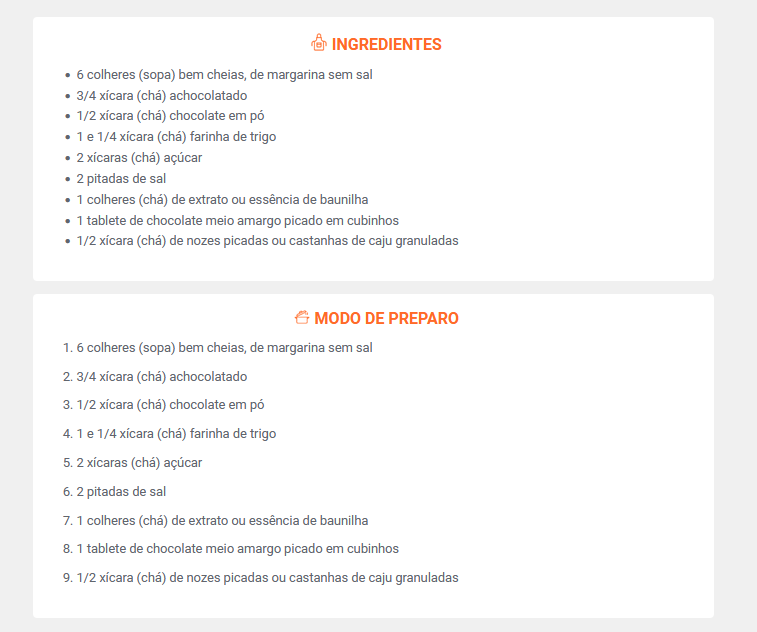
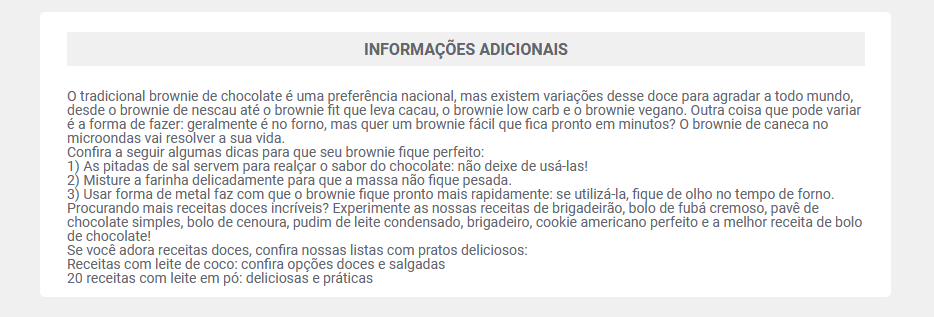

<h2>Exercício do curso Hall To Code</h2>

O objetivo era simular uma página de receita de brownie. Pretendo melhorar o resultado conforme for aprendendo mais :)

Ainda está em progresso.. O maior desafio no momento está sendo organizar o item do membro e a caixa de informações adicionais.

Consegui! Graças ao código disponibilizado no classroom, consegui melhorar a aparência da página :)

